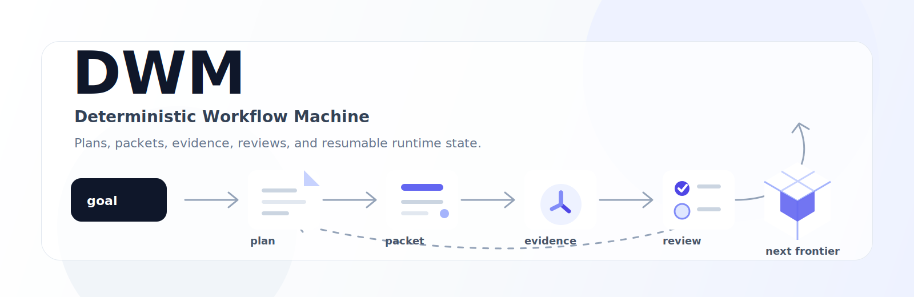
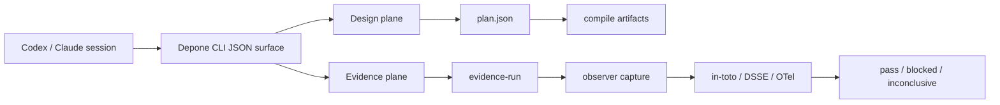
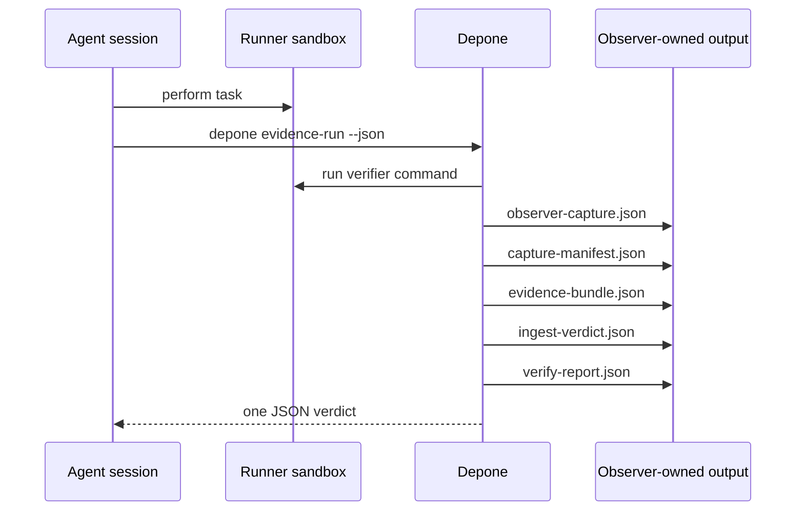
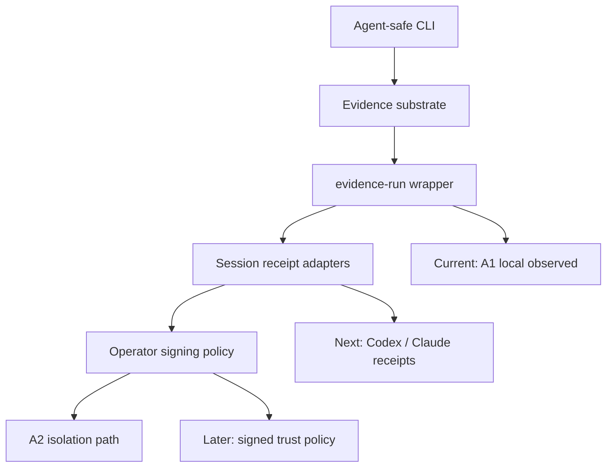

# Depone
> Workflow designer + cross-platform evidence verifier for multi-agent AI systems.
[](LICENSE)
[](SKILL.md)
[](https://github.com/Moonweave-Systems/keelplane/releases)
[](scripts/check_contract.py)



**Depone** generates safe workflow contracts and verifies agent-session
execution evidence. It does not execute agents - it makes runs from other
frameworks and agent sessions (Codex, Claude, Conductor, LangGraph)
trustworthy.

## Quickstart

```bash
# Installation from source. PyPI publishing is not active yet.
git clone https://github.com/Moonweave-Systems/keelplane
cd keelplane
python -m pip install --no-deps .

# Check the agent-safe tool surface.
depone doctor --json

# Run the offline design -> compile -> verify demo.
depone demo --json --out depone-quickstart

# Or step by step:
depone design "audit all API routes for authentication" --surface . --out plan.json
depone validate plan.json
depone compile plan.json --target conductor --out workflow.yaml
depone verify plan.json --evidence ./evidence/ --out report.json --operator-view-out operator-view.md

# MCP stdio server for MCP-capable agents: python -m depone mcp
```

Agent-session evidence loop:

```bash
depone evidence-run --runner-sandbox ./runner-worktree \
  --source-fixture depone/fixtures/agent_fabric/reference_adapter_shell.json \
  --out ../observer/evidence-run --allow-touched-file sample.txt \
  --verify-plan plan.json --verify-evidence ./evidence \
  --json -- python -m unittest
```

## What Exists Today
Depone ships the stdlib-only CLI, a strict plan validator, a Conductor YAML
emitter, a generic evidence adapter, and the bounded verification engine.
Run model: a `slice` is one atomic worker task, a `wave` is a gated group of
one or more slices, and a `run` is one or more waves verified by receipts and
evidence gates.

## System Map



## Command Reference

| Command | Description |
|---|---|
| `depone doctor` | Check package-local readiness for agent-session use |
| `depone design` | Generate a safe workflow contract from a broad objective |
| `depone validate` | Validate a plan.json against the schema v0.5 |
| `depone compile` | Translate a plan into a target framework format (Conductor YAML) |
| `depone verify` | Verify execution evidence against a plan |
| `depone observe` | Capture observer-owned evidence for a runner sandbox |
| `depone evidence-substrate` | Emit in-toto/DSSE and OTel GenAI-shaped evidence |
| `depone evidence-ingest` | Verify external evidence subject digests as untrusted input |
| `depone evidence-chain` | Verify an ordered append-only capture manifest chain |
| `depone evidence-run` | Run the common observe -> substrate -> ingest -> verify loop |
| `depone mcp` | Serve the same evidence/verify capabilities over MCP stdio |
| `depone demo` | Run a complete design -> compile -> verify cycle |

Internal compatibility commands remain available for existing automation:
`validate-contracts` and the `agent-fabric-*` command family.

## Normal Loop



## Product Thesis

> Depone designs multi-agent workflows and verifies their execution evidence.
> It does not execute agents. It makes runs from other frameworks trustworthy.

`design` makes safe workflow contracts, `compile` emits target artifacts, and
`verify` checks execution evidence against the plan.

## Safety Model

Depone treats artifacts, not model claims, as the source of truth.
Generated `out/` directories are verification evidence, not source of truth.
Destructive actions, network access, dependency installation, secret access,
production deployment, and history rewrite require explicit gates.

## Roadmap



## What Is Still Honest
Depone claims **no direct-agent superiority** - it is a design + verification layer, not an agent runtime.
It does not claim upward performance. It is not a public benchmark graph.
public trend promotion requires real release history and measured improvements
over established baselines; it is blocked until release history supports it.
Trend promotion is blocked until release history supports the claim.
The skill is named `depone`.

### Inspection & diagnostics

```bash
python scripts/dwm.py doctor
python scripts/dwm.py commands --kind product
python scripts/check_readme_quality.py README.md
```
Legacy diagnostics: `python scripts/dwm_demo.py run --out out/demo/quickstart`, `python scripts/dwm_demo.py inspect --demo out/demo/quickstart`, `python scripts/dwm.py status --run out/v9/v32-semantic-dogfood`, `python scripts/dwm.py next --run out/v9/v32-semantic-dogfood`, `python scripts/dwm.py commands --kind release`.

## Evidence Graphs


*Dogfood benchmark progression across attempts.*


*Live benchmark history - not a public benchmark graph. Benchmark visuals are source-bound.*

## Quality

Core CLI commands include built-in `--self-test`, including `verify`,
`observe`, `evidence-substrate`, `evidence-ingest`, `evidence-run`, and `demo`.

```bash
python scripts/check_contract.py --tier changed
```

## Position

Depone is not a prompt-only workflow router and not a clone of any one
runtime. It is a design + verification layer above existing execution engines.
DWM Core keeps agentic work inspectable, reproducible, resumable, and honest
about what has actually been executed.
## Documentation
- [`docs/agent-tool-contract.md`](docs/agent-tool-contract.md): agent-facing CLI and evidence contract.
- [`docs/command-reference.md`](docs/command-reference.md) and [`docs/spec.md`](docs/spec.md): command reference and product spec.
- [`docs/release-history.md`](docs/release-history.md): versioned implementation history.
- [`references/workflow-plan-schema.md`](references/workflow-plan-schema.md): plan schema v0.5 reference.
- [`SKILL.md`](SKILL.md): installed agent skill for Codex environments.

## License

MIT. See [`LICENSE`](LICENSE).
